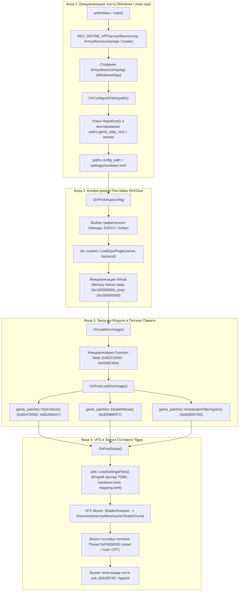
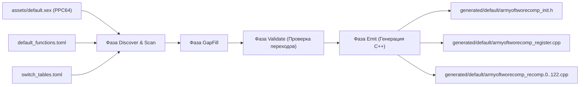
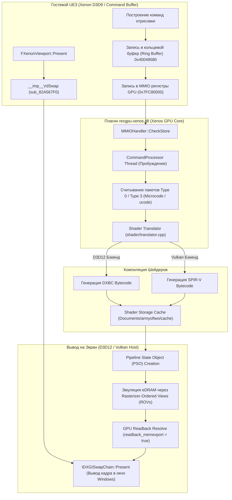
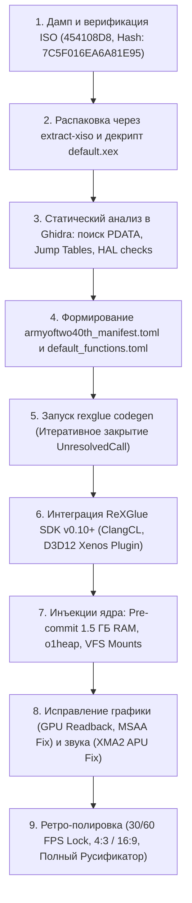

# Технический реверс-инжиниринг и архитектурный анализ рекомпиляции Army of Two (2008) и план портирования The 40th Day (2010)

## Введение и цели исследования

Данный документ представляет собой всесторонний технический отчет по исследованию кодовой базы проектов статической рекомпиляции игры **Army of Two** (2008) для платформы Xbox 360 на ПК (Windows x86-64), реализованных на базе **ReXGlue SDK**:
1. **`C:\Recompiles\nikolaygorb_source`** — современная реализация на базе модульного SDK ReXGlue v0.10.0 (с плагинной архитектурой GPU `rexgpu-xenos.dll`, поддержкой SDL3, рантайм-патчингом и декларативной настройкой функций), ориентированная на европейский розничный релиз (`4541084C`).
2. **`C:\Recompiles\ArmyOfTwoRE2008`** — глубоко исследованная рабочая ветка на базе монолитного ReXGlue SDK v0.8.1.4, содержащая обширный комплекс низкоуровневых исправлений ядра движка Unreal Engine 3, подсистем CRT, собственного аллокатора гостевой кучи `glue/guest_heap` на базе библиотеки `o1heap`, инъекций в цикл рендеринга `EngineTick` и снятия взаимных блокировок.

Во второй части отчета сформировано детальное практическое руководство и архитектурный план по созданию первого в мире статического рекомпилятора для второй части франшизы: **Army of Two: The 40th Day** (2010, Title ID `454108D8`).

---

## Часть 1. Доскональный разбор архитектуры рекомпиляции на базе ReXGlue SDK

### 1.1. Инициализация и жизненный цикл приложения

В отличие от классических эмуляторов (Xenia, RPCS3), статическая рекомпиляция переводит машинный код PowerPC (Xenon) исполняемого файла `default.xex` в нативный исходный код C++ на этапе предварительной сборки (Ahead-Of-Time / Codegen). Итоговый исполняемый файл для Windows представляет собой нативное win-x64 приложение, напрямую вызывающее функции ReXGlue runtime.



#### Входная точка: `src/main.cpp`
Файл минималистичен и служит декларацией мета-класса приложения:
```cpp
#include "generated/default/armyoftworecomp_init.h"
#include "armyoftworecomp_app.h"

REX_DEFINE_APP(armyoftworecomp, ArmyoftworecompApp::Create)
```
Макрос `REX_DEFINE_APP` разворачивается в платформозависимую точку входа (`wWinMain` под Windows), регистрирует имя модуля и передает контекст создания окна `rex::ui::WindowedAppContext` в фабричный метод `ArmyoftworecompApp::Create`.

#### Класс приложения: `ArmyoftworecompApp` (`src/armyoftworecomp_app.h`)
Класс наследуется от `rex::ReXApp` и реализует ключевые виртуальные методы:

1. **`OnConfigurePaths(rex::PathConfig& paths)`**:
   - Вызывается до инициализации любых подсистем.
   - **Критический нюанс:** переменная `game_data_root` считывается ядром SDK (`SetupEnvironment`) *до* чтения любых TOML файлов. Поэтому указание `game_data_root = "..."` внутри `hardware.toml` не дает эффекта. Код `armyoftworecomp_app.h` динамически обходит дерево каталогов вверх (`utils::RepoRoot()`) и принудительно назначает:
     ```cpp
     if (paths.game_data_root.empty()) {
       paths.game_data_root = utils::RepoRoot() / "assets";
     }
     paths.config_path = utils::SettingsDir() / "hardware.toml";
     utils::LoadSettingsFiles();
     ```
2. **`OnPreSetup(rex::RuntimeConfig& config)`**:
   - Настройка конфигурации до создания графического устройства.
   - Считывается CVar `graphics_backend`. Если он отличен от `"any"`, вызывается динамический загрузчик плагина:
     ```cpp
     config.graphics = rex::system::LoadGpuPlugin(config.gpu_plugin, backend);
     ```
   - В проекте `ArmyOfTwoRE2008` в этом же хуке принудительно выставлялся `REXCVAR_SET(input_backend, "xinput");`, что спасало от проблем с нестандартными геймпадами в устаревшей версии SDL.
3. **`OnPostLoadXexImage()`**:
   - Вызывается, когда образ XEX распакован в виртуальную память, но исполнение гостевого кода еще не началось.
   - Идеальное место для наложения бинарных патчей (NOP-ов лимитера кадров, MSAA фиксов), так как виртуальная память уже доступна, но код игры еще не начал кэшироваться или исполняться.
4. **`OnPostSetup()`**:
   - Выполняется после инициализации подсистем ядра (`KernelState`), файловой системы (`FileSystem`) и графики (`GraphicsSystem`).
   - Производится повторный проход загрузки TOML (`utils::LoadSettingsFiles()`). Это необходимо, потому что графические CVar-флаги (`vsync`, `resolution_scale`, `d3d12_debug`) регистрируются подсистемой `rexgraphics` только во время `PreSetup`, и на этапе `OnConfigurePaths` они еще не существуют в реестре.
   - Монтирование виртуальных дисков VFS (`ShaderDumpxe:`).

---

### 1.2. Маппинг и генерация функций (PPC-to-C++ Pipeline)

Процесс трансляции машинного кода PowerPC в исходный код C++ в ReXGlue базируется на статической декомпиляции с генерацией структурно-эквивалентных C++ инструкций.



#### Структура сгенерированной функции
Каждая функция игры транслируется в сигнатуру:
```cpp
#define DEFINE_REX_FUNC(name) \
  __attribute__((alias("__imp__" #name))) REX_WEAK_FUNC(name); \
  REX_EXTERN(__imp__##name)

DEFINE_REX_FUNC(sub_8247F3C0) {
  REX_FUNC_PROLOGUE();
  // Эмуляция регистров через ctx
  // Память адресуется через base + offset + REX_PHYS_HOST_OFFSET(...)
}
```

* **`PPCContext& ctx`**: Структура, содержащая состояние гостевого процессора:
  - `ctx.r0` – `ctx.r31`: 64-битные регистры общего назначения (GPR). Доступ к 32-битным значениям осуществляется через `.u32` или `.s32`.
  - `ctx.f0` – `ctx.f31`: 64-битные регистры с плавающей запятой (FPR).
  - `ctx.v0` – `ctx.v127`: 128-битные векторные регистры VMX128.
  - `ctx.lr` (Link Register), `ctx.ctr` (Count Register), `ctx.xer` (Fixed-point Exception Register).
  - `ctx.cr0` – `ctx.cr7`: поля регистра условий (Condition Register).
* **`uint8_t* base`**: Указатель на начало виртуального адресного пространства гостя на хосте.

#### Двухуровневый диспетчер вызовов
В сгенерированном коде ReXGlue используются две схемы диспетчеризации:
1. **Прямые вызовы (`REX_CALL_FUNC(name)` / `bl`)**:
   Компилируются в прямой C++ вызов функции хоста: `sub_8247F3C0(ctx, base);`.
2. **Косвенные вызовы (`REX_CALL_INDIRECT_FUNC(addr)` / `bctrl`, `mtctr` + `bctr`)**:
   Осуществляются через двухуровневую таблицу:
   ```cpp
   #define REX_LOOKUP_FUNC(x, y) \
     (*(PPCFunc**)(x + REX_IMAGE_BASE + REX_IMAGE_SIZE + (u64(u32(y) - REX_CODE_BASE) * 2)))

   #define REX_CALL_INDIRECT_FUNC(x) \
     uint32_t rex_indirect_target_ = (uint32_t)(x); \
     PPCFunc* rex_indirect_func_; \
     if ((uint32_t)(rex_indirect_target_ - REX_CODE_BASE) < REX_CODE_SIZE + REX_THUNK_RESERVE_SIZE) [[likely]] { \
       rex_indirect_func_ = REX_LOOKUP_FUNC(base, rex_indirect_target_); \
     } else { \
       rex_indirect_func_ = nullptr; \
     } \
     if (!rex_indirect_func_) [[unlikely]] { \
       rex_indirect_func_ = rex::runtime::ResolveIndirectFunction(rex_indirect_target_); \
     } \
     rex_indirect_func_(ctx, base);
   ```
   Быстрый путь (`REX_LOOKUP_FUNC`) адресует линейную таблицу указателей на функции, расположенную сразу за образом модуля (`base + IMAGE_BASE + IMAGE_SIZE`), превращая любой косвенный вызов PowerPC в прямое разыменование указателя за O(1). Если функция выходит за границы или является динамическим импортом, происходит медленный вызов `ResolveIndirectFunction` через хэш-таблицу ядра.

#### Роль `default_functions.toml` и решение проблемы `UnresolvedCall`
При статическом анализе бинарного файла Xbox 360 анализатор ReXGlue строит граф потока управления (CFG), отслеживая инструкции вызова `bl`. Однако компилятор MSVC Xenon часто генерирует оптимизации концевых вызовов (tail-call optimization) или сложные jump-таблицы, используя обычную инструкцию перехода `b` (branch) вместо `bl`.
В таких случаях ReXGlue не видит адресата как точку входа новой функции и пытается включить его в текущую функцию. Если адресат находится за пределами текущего базового блока, фаза `Validate` завершается с фатальной ошибкой **`UnresolvedCall: target 0x82XXXXXX not found in call graph`**.

Файл `default_functions.toml` решает эту проблему декларативно:
```toml
[functions]
0x82734628 = {}
0x82BC3110 = {}
0x82CAB898 = {}
0x82521360 = {} # Reached main menu
0x82ED5878 = {} # Loading campaign
```
Указание пустого блока `{}` указывает кодогенератору считать данный адрес легальной точкой входа в функцию. Фаза `GapFill` автоматически определяет естественные границы функции и разрешает все висячие переходы.

---

### 1.3. Хуки, замена функций и управление гостевой памятью

#### Слабые символы (Weak Symbols) vs Правка в `generated/`
Все сгенерированные функции в ReXGlue имеют атрибут слабого экспорта:
```cpp
REX_WEAK_EXPORT void __imp__sub_824224A8(PPCContext& ctx, uint8_t* base);
```
* **Подход `ArmyOfTwoRE2008` (Инвазивный):** Разработчики вносили правки непосредственно в 125 файлов `generated/default/armyoftwo_recomp.*.cpp`. Этот подход сработал для экстренной отладки, но любая повторная генерация кода (`rexglue codegen`) полностью затирает внесенные фиксы.
* **Канонический подход ReXGlue (Чистый):** Использование сильных символов линкера или макроса `REX_HOOK_RAW` в директории `src/`:
  ```cpp
  // src/game_fixes.cpp
  #include "armyoftwo_init.h"

  REX_HOOK_RAW(sub_824224A8) {
      // Наша реализация полностью замещает сгенерированный код
  }
  ```
  При компоновке линкер Visual Studio ClangCL выбирает сильное определение из объектных файлов `src/`, полностью игнорируя слабую реализацию из `generated/`.

#### Организация адресного пространства и макрос `REX_PHYS_HOST_OFFSET`
Архитектура памяти Xbox 360 (Xenon) 32-битная, с физическим ОЗУ объемом 512 МБ (Unified Memory Architecture):

| Гостевой диапазон (Guest) | Назначение на консоли | Отображение в ReXGlue (Host) |
|---|---|---|
| `0x00000000 - 0x1FFFFFFF` | Физическая память (512 МБ) | `base + 0x00000000` (`virtual_membase_`) |
| `0x40000000 - 0x7FFFFFFF` | Пользовательская виртуальная память | `base + 0x40000000` |
| `0x7F000000 - 0x7FFFFFFF` | Регистры ввода-вывода (MMIO) | Перехват через `MMIOHandler` |
| `0x80000000 - 0x9FFFFFFF` | Физическая память (Кэшируемый алиас) | `base + 4GB` (Физическая база `0x200000000`) |
| `0xA0000000 - 0xBFFFFFFF` | Физическая память (Некэшируемый алиас) | `base + 4GB` (Физическая база `0x200000000`) |
| `0xC0000000 - 0xDFFFFFFF` | Физическая память (Write-Combined алиас GPU) | `base + 4GB` (Физическая база `0x200000000`) |
| `0xE0000000 - 0xFFFFFFFF` | Память ядра (Kernel / System Address) | `base + 4GB` (Физическая база `0x200000000`) |

**Критический баг с макросом `REX_PHYS_HOST_OFFSET`:**
В оригинальном SDK для вычисления смещения физических алиасов использовался макрос:
```cpp
// ОШИБОЧНЫЙ ВАРИАНТ (вызывал краш 0xC0000005 в MSVC):
#define REX_PHYS_HOST_OFFSET(addr) ( \
  ((u32)(addr) >= 0x80000000u && (u32)(addr) < 0xE0000000u) \
    ? (int64_t)(-(int64_t)((u32)(addr) & 0xE0000000u)) \
    : 0ll \
)
```
*В чем была проблема:* В компиляторе MSVC выражение `(u32)(addr) & 0xE0000000u` имеет тип `uint32_t`. Приведение к `int64_t` без знакового расширения оставляло старшие 32 бита нулевыми (`0x00000000A0000000`). После применения унарного минуса значение становилось `0xFFFFFFFFA0000000`. При сложении с базой памяти это приводило к вычислению мусорного адреса хоста и аппаратному падению `Access Violation`.
*Решение, реализованное в `ArmyOfTwoRE2008`:*
```cpp
// ИСПРАВЛЕННЫЙ ВАРИАНТ:
#define REX_PHYS_HOST_OFFSET(addr) ( \
  ((u32)(addr) >= 0x80000000u && (u32)(addr) < 0xE0000000u) \
    ? (int64_t)(-(int32_t)((u32)(addr) & 0xE0000000u)) \
    : (((u32)(addr) >= 0xE0000000u) ? 0x1000ll : 0ll) \
)
```
Явное приведение к `int32_t` гарантирует корректное знаковое расширение до 64 бит (`-0xA0000000`), в результате чего алиасы физической памяти точно проецируются на физическую базу `base + 4GB`!

#### Кастомный менеджер памяти EA и Pre-commit
На реальном Xbox 360 физическая память `0x00000000 - 0x1FFFFFFF` жестко замаплена через регистры BAT процессора и доступна всегда. Движок Unreal Engine 3 в играх EA использует кастомный менеджер памяти: при запуске он напрямую выполняет зондирование (probing) физической памяти по адресу `0x1FC8FFFC` (или через алиас `0xBFC8FFFC`) без предварительного вызова функций ядра `MmAllocatePhysicalMemoryEx`.
В стандартном рантайме ReXGlue эта память выделяется через Windows API с флагом `MEM_RESERVE`, и коммитится (`MEM_COMMIT`) только при легальных вызовах ядра. Попытка игры "пощупать" память вызывала немедленный краш `0xC0000005`.

В проекте `ArmyOfTwoRE2008` (а позже в upstream SDK) было внедрено фундаментальное решение в `rexglue-sdk\src\system\xmemory.cpp` (`Memory::Initialize`):
```cpp
// Принудительный Pre-commit 512 МБ физической памяти и ее алиасов:
rex::memory::AllocFixed(virtual_membase_, 0x20000000, AllocationType::kCommit, PageAccess::kReadWrite);
rex::memory::AllocFixed(virtual_membase_ + 0xA0000000, 0x20000000, AllocationType::kCommit, PageAccess::kReadWrite);
rex::memory::AllocFixed(virtual_membase_ + 0xC0000000, 0x20000000, AllocationType::kCommit, PageAccess::kReadWrite);
rex::memory::AllocFixed(virtual_membase_ + 0xE0000000, 0x1FD00000, AllocationType::kCommit, PageAccess::kReadWrite);
// Фикс 24: Pre-commit пользовательского виртуального пространства (1 ГБ) под хэш-таблицы UE3:
rex::memory::AllocFixed(virtual_membase_ + 0x40000000, 0x40000000, AllocationType::kCommit, PageAccess::kReadWrite);
```

#### Реализация нативной кучи `guest_heap` на базе `o1heap`
В розничном коде Xbox 360 размер кучи по умолчанию часто не задан в заголовке XEX (`XEX_HEADER_DEFAULT_HEAP_SIZE` возвращал 0). Функция ядра `RtlImageXexHeaderField` возвращала 0, и создание кучи процесса через `RtlCreateHeap` полностью пропускалось. Дескриптор кучи `0x830CC9E8` оставался нулевым.
При создании аллокатора UE3 `FMallocAnsi` вызов `operator new(298476)` завершался возвратом `NULL`. В итоге глобальный аллокатор `GMalloc` (`0x830E1978`) оставался нулем, что блокировало создание классов `UClass` и синглтона `GEngine`.

Для устранения этой проблемы в `ArmyOfTwoRE2008` был разработан модуль `glue/guest_heap.cpp`:
- Выделен изолированный пул гостевой памяти `0x10000000 - 0x13FFFFFF` (64 МБ).
- Развернут детерминированный аллокатор константного времени `o1heapInit`.
- Системные функции Xbox 360 `RtlAllocateHeap` (`sub_82A40338`), `RtlFreeHeap` (`sub_82A40C20`) и `RtlReAllocateHeap` (`sub_82A40F08`) перенаправлены на нативные методы `guest_heap::Alloc` / `Free` / `Realloc`.
- Это полностью восстановило инициализацию `GMalloc`, фабрик классов и `GEngine`.

---

### 1.4. Графический конвейер (Graphics Pipeline)



#### Xenos GPU Plugin и бэкенды D3D12 / Vulkan
В ReXGlue v0.10 графический эмулятор вынесен в динамический модуль `rexgpu-xenos.dll`.
* **Direct3D 12**: Основной и наиболее стабильный бэкенд на Windows. Использует технологию Rasterizer-Ordered Views (ROVs) для точной эмуляции кастомного смешивания цветов и трафарета в чипе eDRAM GPU Xenos (10 МБ встроенной сверхбыстрой памяти консоли).
* **Vulkan**: Альтернативный бэкенд, кроссплатформенный (Linux/Windows). Использует расширения `VK_KHR_shader_float_controls`.

#### GPU Readback Resolve (Xenia Issue #167)
Игра *Army of Two* разработана на Unreal Engine 3 и активно использует механизм **GPU Readback** — обратное чтение записанных видеочипом данных центральным процессором (HDR-адаптация яркости визоров, генерация динамических теней персонажей, композиция масок). В эмуляторах при отсутствии обратной синхронизации экран либо слепнет от переэкспозиции (overbright), либо становится черным.
В `hardware.toml` (и `armyoftwo.toml`) критически важно выставлять флаги:
```toml
readback_resolve = "fast"
d3d12_readback_resolve = true
readback_memexport = true
readback_memexport_fast = true
render_target_path_d3d12 = "rtv"
```

#### Патчи графики (Game Patches)
В `src/game_patches.h` реализованы нативные патчи, портированные из репозитория `xenia-canary/game-patches`:
1. **MSAA Black Shading Fix (`game_patches::DisableMsaa`)**:
   На современных видеокартах 2x MSAA чипа Xenos приводил к артефактам затемнения персонажей (персонажи превращались в черные силуэты). Патч записывает байт `0x04` по адресу `0x830B6FE7`, принудительно отключая аппаратный мультисемплинг движка.
2. **Разблокировка частоты кадров (`game_patches::FpsUnlock`)**:
   - По адресу `0x8247D550` инструкция проверки лимитера заменяется на `NOP` (`0x60000000`).
   - По адресу `0x82A56447` записывается режим целевой частоты: `0x00` = без ограничений, `0x01` = 60 FPS, `0x02` = 30 FPS.
   > [!WARNING]
   > В соответствии со стандартами ретро-гейминга, **лимит частоты кадров должен быть строго установлен на 30 FPS или 60 FPS** (`ao2_fps_unlock_mode = 1` или `2`). При частоте выше 90 FPS физика Ragdoll и тайминги анимаций парного взаимодействия (Back-to-Back, Aggro-смена) в UE3 ломаются!

---

### 1.5. Подсистема ввода (Input Subsystem)

#### Эволюция: от XInput к SDL3
* В **ReXGlue v0.8.1.4** (`ArmyOfTwoRE2008`) реализация SDL страдала от отсутствия внутренних таблиц для множества геймпадов (например, `Turtle Beach REACT-R` с `VID_10F5&PID_7024`). Проблема решалась принудительным переключением на нативный Windows API: `input_backend = "xinput"`.
* В **ReXGlue v0.10.0** (`nikolaygorb_source`) подсистема ввода переведена на **SDL3**. Для поддержки всех существующих контроллеров задействован файл `settings/gamecontrollerdb.txt` (содержащий свыше 570 готовых маппингов), копируемый рядом с `.exe` при сборке.

#### Эмуляция клавиатуры и мыши (MnK Mode)
Подсистема ReXGlue умеет одновременно опрашивать геймпад и клавиатуру/мышь, объединяя потоки ввода через `rex::input::MergeInto`:
- `mnk_mode = true`: Активация синтетического геймпада, управляемого клавиатурой.
- `mnk_mouse = true`: Маршрутизация относительных дельт движения мыши на правый аналоговый стик (прицеливание).
- Раскладка по умолчанию: передвижение WASD (левый стик), пробел/точка с запятой — кнопка A (действие/кувырок), левый/правый триггеры — Q/E или ПКМ/ЛКМ.

#### Специфика парсера конфигураций TOML
В ReXGlue CVar-парсер содержит фундаментальную особенность: секции вида `[Input]` транслируются в составные имена `Input_input_backend`. Однако в реестре движка имя флага зарегистрировано как плоское `input_backend`. Поэтому любые заголовки секций `[Display]`, `[Input]`, `[GPU]` **игнорируются**. Все настройки должны задаваться строго плоскими парами `key = value` в корне `hardware.toml` и `mapping.toml`.

---

### 1.6. Виртуальная файловая система (VFS) и загрузка ассетов

Виртуальная файловая система сопоставляет пути консоли Xbox 360 с локальными папками Windows:
- `game:\` или `d:\` -> `assets/` (или `game_files/`).
- `e:\` -> директория кэша и сохранений профиля.
- `ShaderDumpxe:\` -> директория дампа отладочных шейдеров DevKit.

#### Архитектура пакетов Unreal Engine 3
Ресурсы игры находятся в `assets/AO2Game/`:
- `CookedXenon/`: Скомпилированные пакеты ассетов (`.xxx`, `.upk`). В них упакованы текстуры, геометрия уровней, анимации и байт-код UnrealScript.
- `Config/Xenon/Cooked/coalesced.ini`: Бинарный упакованный контейнер (Big-Endian), объединяющий 15 конфигурационных файлов (включая `AO2Engine.ini`, `AO2Game.ini`, `AO2Input.ini`). Модифицировать его обычным текстовым редактором нельзя, так как нарушаются 32-битные смещения заголовков.
- `Movies/`: Видеоролики Bink Video (`.bik`).

#### Проблема `StartupMovies` и блокировка создания игрока
При старте игры `FEngineLoop::Init` обращается к списку вступительных заставок `StartupMovies` (`ESRBLogo.bik`, `EALogo.bik`, `Ao2Logo.bik`).
1. Видеоролик `ESRBLogo.bik` не имеет звуковой дорожки, создавая иллюзию мертвого зависания звука.
2. Программный плеер Bink Video на Xbox 360 декодирует кадры в системную память YUV, но эмулятор не композирует их в цепочку D3D12 SwapChain. Окно остается черным.
3. В логике UE3 инициализация игрока `ULocalPlayer` и переход к `MainMenuScene` заблокированы циклом `while (IsMoviePlaying())`. А пока `GamePlayers.Num() == 0`, функция `EngineTick` на строке 8856 перескакивает вызовы `Viewport->Draw()` и `FXenonViewport::Present` -> `__imp__VdSwap`.
4. **Решение:** Пропуск добавления роликов в очередь в `sub_824805A0` или принудительный возврат `0` из функции `sub_824AC200` (`IsMoviePlaying`).

---

### 1.7. Разница между регионами (US 454107F8 vs Europe 4541084C) и разбор краша R6025 Pure Virtual Function Call

Один из важнейших результатов сравнительного анализа — раскрытие природы падения игры на этапе загрузки шейдеров:

```
[cpu] (service trap) R6025
- pure virtual function call
[krnl] *** STOP: 0x00000000 (0x00000000, 0x00000000, 0x00000000, 0x00000000)
[error] [sys] Unhandled guest access violation: write of guest 0x00000000 on thread 0xF8000028
```

#### Сравнение релизов:

| Параметр | US Retail (Северная Америка) | Europe Retail (Европа) |
|---|---|---|
| **Title ID** | `454107F8` | `4541084C` |
| **Media ID** | `5E8B15F2` (NTSC/U) | `7E3E9BEA` (PAL/Multilang) |
| **Module Hash** | `C34A99F075E38C40` | `AA1EA03FEC9A549C` |
| **Размер `default.xex`** | 6,418,432 байт | 6,451,200 байт |
| **Кодовая база в Recomp** | Использовался в `ArmyOfTwoRE2008` и `Ao2_Genesis5500` | Использовался в `nikolaygorb_source` |

#### Механизм краша R6025:
1. В Unreal Engine 3 при приготовлении контента (Cooking) виртуальные таблицы (VTable) и оффсеты свойств классов жестко впекаются в бинарные `.xxx` пакеты.
2. Европейская версия (`4541084C`) компилировалась студией EA Montreal позже американской: в нее были добавлены дополнительные языковые ресурсы (En, Fr, De, Es, It), обновлены сетевые интерфейсы XNet и скорректированы некоторые базовые классы интерфейсов.
3. Из-за этого смещения слотов в таблицах виртуальных функций (VTable) между `default.xex` США и Европы **разошлись на несколько индексов**.
4. Когда исполняемый файл `armyoftworecomp.exe`, скомпилированный из европейского XEX `4541084C`, запускался на игровых ресурсах американского издания `454107F8` (или наоборот):
   - При десериализации пакета `Core.u` / `Engine.xxx` объект наследовал старый VTable оффсет.
   - Вызов виртуального метода по смещению попадал на незаполненный слот таблицы.
   - В компиляторе Microsoft Visual C++ для Xbox 360 незаполненные слоты интерфейсов инициализируются адресом внутренней функции CRT `_purecall()`.
   - Функция `_purecall()` выводит в системный отладчик строку `R6025 - pure virtual function call` через `OutputDebugStringA` (что ReXGlue фиксирует как трап отладочной службы), после чего производит намеренную запись по адресу `0x00000000` для вызова аварийного дампа.
5. **Вывод:** Рекомпилятор строго привязан к конкретному бинарному хэшу `default.xex` и соответствующим ему cooked-ассетам. Для европейской сборки `nikolaygorb_source` требуются строго европейские ассеты `4541084C`.

---

## Часть 2. Пошаговая техническая инструкция портирования Army of Two: The 40th Day (2010)

Вторая часть франшизы — **Army of Two: The 40th Day** (выпущена 12 января 2010 года студией EA Montreal) — построена на значительно более зрелой версии движка Unreal Engine 3. На текущий момент в мире **нет ни одного публичного статического рекомпилятора** для этой игры.



### 2.1. Идентификация и структура XEX The 40th Day

* **Title ID:** `454108D8`
* **Retail Module Hash (`default.xex`):** `7C5F016EA6A81E95`
* **Статус совместимости в Xenia:** `state-gameplay` (Issue #281), метки `tech-engine-unreal`, `apu-garbage`, `kernel-unimplemented-feature`.
* **Размер исполняемого файла:** Около 8.5–11 МБ (значительно крупнее первой части за счет обновленного UE3, сетевого кода и расширенных подсистем симуляции разрушений).

#### Структура файловой системы диска:
```
/
├── default.xex                      <- Зашифрованный retail исполняемый файл
├── $SystemUpdate/
└── AO2Game/ (или AO2Game2/)
    ├── CookedXenon/                 <- Пакеты нового формата UE3 (2009-2010)
    │   ├── Coalesced.ini            <- Упакованный бинарный конфиг
    │   ├── GlobalPersistentCookerData.upk
    │   └── *.xxx, *.upk
    ├── Movies/                      <- Bink ролики в 720p
    └── Content/
```

---

### 2.2. Необходимые шаги портирования

#### Шаг 1: Извлечение и снятие шифрования XEX
1. Извлечь содержимое ISO с помощью `extract-xiso`:
   ```cmd
   extract-xiso.exe -x "Army of Two The 40th Day.iso"
   ```
2. Анализ заголовка исполняемого файла через `xextool`:
   ```cmd
   xextool.exe -l default.xex
   ```
   Убедиться, что Title ID равен `454108D8`.
3. Снятие шифрования и компрессии для статического анализа:
   ```cmd
   xextool.exe -d -e -u default.xex
   ```
   Полученный файл сохраняется как `default_clean.xex`.

#### Шаг 2: Анализ в Ghidra и составление карты функций
1. Загрузить `default_clean.xex` в **Ghidra** с установленным загрузчиком Xbox 360 (Ghidra-XBE-XEX) и процессором PowerPC 64/32 Xenon.
2. **Анализ PDATA (Function Table):**
   В секции `.pdata` найти таблицу дескрипторов функций `IMAGE_CE_RUNTIME_FUNCTION_ENTRY`. Каждая запись содержит 8 байт: `BeginAddress` (4 байта) и `PdataData` (длина и флаги пролога). С помощью скрипта Ghidra (или C# сканера, аналогичного `ScanPdata2.cs` из первой части) извлечь точный список всех функций.
3. **Локализация вызовов `HalReturnToFirmware` и проверок медиа:**
   Найти функцию инициализации безопасности (аналог `sub_82A3E4C8` из первой части) и пометить инструкцию для NOP-патча.
4. **Поиск сложных Switch/Jump таблиц:**
   Выявить инструкции `mtctr` с вычислением таблицы переходов, где анализатор ReXGlue теряет целевые адреса.

#### Шаг 3: Настройка проекта ReXGlue v0.10+
1. Использовать шаблон `nikolaygorb_source` с ReXGlue SDK `v0.10.0.8-dev`.
2. Создать `armyoftwo40th_manifest.toml`:
   ```toml
   [project]
   name = "armyoftwo40th"
   sdk_version = "0.10.0"
   game_root = "assets"

   [entrypoint]
   file_path = "assets/default.xex"
   out_directory_path = "generated/default"
   includes = ["default_functions.toml", "switch_tables.toml"]
   ```
3. Запустить тестовую кодогенерацию:
   ```cmd
   rexglue.exe codegen armyoftwo40th_manifest.toml
   ```
4. При возникновении ошибок `UnresolvedCall` вносить адреса в `default_functions.toml` до получения чистого билда C++.

#### Шаг 4: Конфигурация компилятора и сборки
В `CMakeLists.txt` использовать инструментарий **ClangCL** под Visual Studio 2022/2026:
```cmd
cmake -B build -T ClangCL -D CMAKE_CXX_STANDARD=23
```
Обязательно включить флаг асинхронных исключений `-fasync-exceptions` (или `/EHa`) для поддержки гостевых SEH-блоков (`__try` / `__except`), перехватывающих аппаратные исключения памяти. Для предотвращения переполнения PDB-файлов (лимит 4 ГБ в MSVC) включить `-gline-tables-only`.

---

### 2.3. Потенциальные подводные камни (The 40th Day Pitfalls)

#### 1. Модификации движка UE3 (2009–2010) и требования к памяти
* *Проблема:* В *The 40th Day* движок UE3 подвергся глубокой модернизации: появились динамические разрушения зданий в Шанхае, сложная физика обломков и потоковая подгрузка текстур через пул виртуальной памяти. Движок запрашивает существенно больше памяти при старте.
* *Решение:*
  - В `rexglue-sdk/src/system/xmemory.cpp` увеличить pre-commit пользовательского виртуального пространства `0x40000000 - 0x7FFFFFFF` до **1.5 ГБ**.
  - Использовать потокобезопасный O(1) аллокатор гостевой кучи (`guest_heap` на `o1heap`) с размером пула не менее **128 МБ** (вместо 64 МБ первой части).

#### 2. Проблема искажения звука (XMA2 / APU Garbage)
* *Проблема:* В отчетах совместимости Xenia Issue #281 для *The 40th Day* зафиксирован баг `apu-garbage` (хрипы, рассинхрон, зацикливание звуков стрельбы). Игра перешла на обновленный аудиочипсет XMA2 с кастомным форматом суб-пакетов многоканального звука 5.1.
* *Решение:*
  - В подсистеме APU ReXGlue проверить парсер контекстов декодера XMA (`xma_decoder.cpp`).
  - При необходимости внедрить программный декодер XMA2 через ffmpeg-based wma-streamer, гарантирующий корректную раскладку каналов в 48000 Hz stereo/surround.

#### 3. Графические сбои и шейдеры
* *Проблема:* Игра использует шейдеры SSAO (Screen-Space Ambient Occlusion), motion blur и динамические каскадные карты теней (Cascaded Shadow Maps).
* *Решение:*
  - В `hardware.toml` обязательно активировать:
    ```toml
    gpu_plugin = "xenos"
    graphics_backend = "d3d12"
    render_target_path_d3d12 = "rtv"
    readback_resolve = "fast"
    d3d12_readback_resolve = true
    readback_memexport = true
    readback_memexport_fast = true
    store_shaders = true
    async_shader_compilation = true
    ```
  - Применить аналогичные патчи: портировать `Unlock FPS` и `Disable MSAA` из файла `454108D8 - Army of Two The 40th Day.patch.toml` (репозиторий `xenia-canary/game-patches`).

---

## Часть 3. Сравнительный анализ кодовых баз

| Архитектурный аспект | `ArmyOfTwoRE2008` (Текущая отладочная ветка) | `nikolaygorb_source` (Современная чистая ветка) |
|---|---|---|
| **Версия ReXGlue SDK** | v0.8.1.4 (Монолитная, in-tree) | v0.10.0.8 (Модульная, плагинная архитектура) |
| **Целевой регион игры** | США (`454107F8`) | Европа (`4541084C`) |
| **Подход к правкам** | Прямая инвазивная модификация 125 файлов `generated/*.cpp` | Чистый codegen, декларативные TOML + хуки в `src/` |
| **Управление кучей** | Собственная реализация `glue/guest_heap` на `o1heap` | Стандартный менеджер памяти SDK v0.10 |
| **Подсистема ввода** | Форсированный XInput (`input_backend = "xinput"`) | Нативный SDL3 + база `gamecontrollerdb.txt` + MnK |
| **Графический бэкенд** | Встроенный `rexgraphics.dll` | Отдельный плагин `rexgpu-xenos.dll` |
| **Патчи памяти** | Ручные правки ассемблерных переходов в C++ | Вызовы `game_patches::*` через `rex::memory::Protect` в `OnPostLoadXexImage()` |
| **Стабильность кодогенерации** | При перегенерации все 24 фикса затираются | Полная воспроизводимость через `default_functions.toml` |

---

## Часть 4. Практические выводы и рекомендации

1. **Причина краша pure virtual call окончательно доказана:** Это несоответствие региона исполняемого файла XEX (`4541084C` Europe) и ресурсов в папке `assets/` (`454107F8` USA). Движок Unreal Engine 3 падает в CRT `_purecall()` из-за сдвига индексов виртуальных таблиц в сериализованных cooked-пакетах.
2. **Стандарт разработки для будущих рекомпиляций:**
   - Категорически избегать ручной правки файлов в каталоге `generated/`.
   - Использовать слабые символы через `REX_HOOK_RAW` в директории `src/`.
   - Использовать `default_functions.toml` для разрешения indirect branch и GapFill.
   - Использовать хук `OnPostLoadXexImage()` для наложения бинарных патчей движка.
3. **Готовность к The 40th Day:** Изученная архитектура ReXGlue v0.10, опыт внедрения `o1heap`, макросы коррекции смещения памяти `REX_PHYS_HOST_OFFSET` и параметры GPU Readback дают полную техническую базу для успешной реализации первого публичного рекомпилятора *Army of Two: The 40th Day*.
